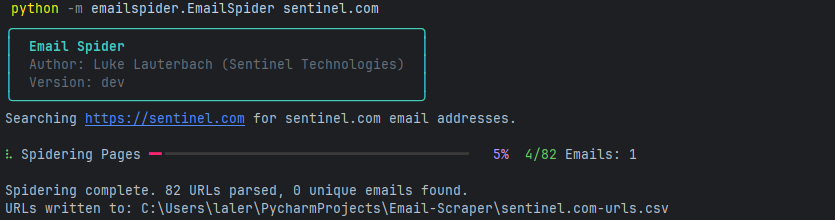

<!-- ABOUT THE PROJECT -->
## About The Project

This script will automatically spider a website, hunting for email addresses on each page. A database of scraped URLs will be kept with the status of if these pages have been scraped, allowing spidering to continue at a later time.

Disclaimer: This script can be used for a variety of purposes, including by organizations to check what email addresses are publicly available on their website. The author is not responsible for how the script is used.



## Installation

### pipx
```shell
pipx install git+https://github.com/LukeLauterbach/Email-Scraper.git
```


### uv
```shell
uv tool install git+https://github.com/LukeLauterbach/Email-Scraper.git
```

## Usage

```shell
emailspider [Domain to Search]
```

## Options
Options | Description
-|-
-h | Help Menu
-e | Email domain to look for
-r | Root page to start searching
-p |  Parameter Mode - By default, the script will ignore parameters in links. With -p, parameters will be treated as individual links.
-n | Number of pages to spider (optional)
-o | Output filename (will default to the email domain name)
-d | Add a delay between web requests
-db | Debug Mode
--wait-for-network-idle | Adds additional delays if the website being parsed is really slow to load.

<p align="right">(<a href="#top">back to top</a>)</p>
